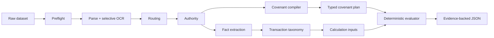
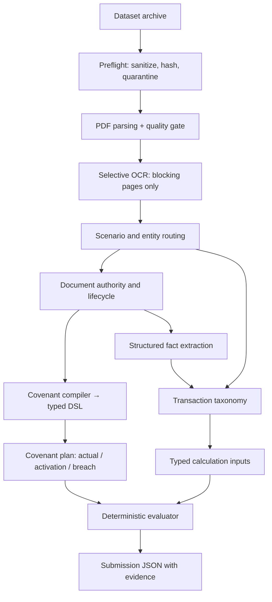

# Halyk AI Challenge — Deterministic Financial Covenant Engine

An auditable pipeline that turns unstructured banking documents and raw transaction ledgers into
**typed covenant rules**, **verified financial facts**, **deterministic calculations**, and
**evidence-backed compliance decisions**.

> **DeepSeek parses semantics. Python decides financial truth.**

A language model never computes an amount, never picks an authoritative document, and never declares
COMPLIANT or BREACH. It is used only where deterministic parsing cannot confidently understand human
language — and every proposal it returns must survive schema, enum, type and exact-quote validation
before it is allowed into the pipeline.



---

## 1. The problem

A single borrower scenario arrives as a pile of heterogeneous, partly contradictory documents:
facility agreements, amendments, superseded prior-year editions, drafts, auditor reports, KYC and
ownership dossiers, group financial statements, treasury notes — plus a ledger of thousands of
transactions, most of which belong to somebody else.

Deciding whether a covenant is met means resolving all of this correctly:

- which document version is actually in force, and which is superseded;
- which ledger rows belong to this borrower at all;
- auditor reclassifications that override the ledger's own booking;
- accounting recognition period vs cash date;
- related-party identity from ownership thresholds;
- group vs borrower accounting scope;
- FX evidence for mixed-currency amounts;
- springing covenants that only apply above a trigger;
- quarterly minima and maxima;
- compound AND / OR default logic.

**Why not just feed it all to an LLM?** Because the output would be unverifiable. Language models
produce plausible arithmetic, not correct arithmetic; they cannot guarantee that the same input
yields the same answer twice; and a number they emit cannot be traced back to a transaction ID or a
page span. In a lending decision, an unsourced number is worse than no number.

---

## 2. Our approach

Deterministic-first, semantic-fallback. Every stage tries exact structural logic; the model is
consulted only for the residue, and only for language.

| Responsibility | Deterministic Python | DeepSeek |
| --- | --- | --- |
| Scenario / account / transaction routing | ✅ sole authority | ❌ never |
| Document type, lifecycle, authority winner | ✅ sole authority | proposes classification only when deterministic result is UNKNOWN |
| Known covenant formula families | ✅ | ❌ |
| Unseen contractual wording | — | ✅ proposes a typed covenant plan |
| Ledger row classification (clear cases) | ✅ | ❌ |
| Ambiguous ledger descriptions | — | ✅ chooses from a fixed enum |
| Structured document facts | ✅ deterministic extractors first | ✅ typed payload + exact quote |
| All arithmetic | ✅ **only** | ❌ forbidden |
| COMPLIANT / BREACH | ✅ **only** | ❌ forbidden |
| Evidence transaction IDs | ✅ deterministic evidence engine | ❌ |
| FX rates | ✅ only from stated evidence | ❌ never inferred |

---

## 3. Architecture



The model sits on bounded side paths, never in the trunk:

```text
Unrecognised covenant wording   → DeepSeek → validated typed AST      → deterministic evaluator
Ambiguous ledger description    → DeepSeek → allowed category enum    → deterministic taxonomy
Complex document fact           → DeepSeek → typed fact + exact quote → deterministic fact store
```

Each arrow out of DeepSeek passes a validation gate. A rejected proposal leaves the cell
**unresolved**; it never degrades into a guess.

---

## 4. Key engineering features

### Safe dataset boundary

`preflight` produces a `sanitized_manifest.json` with SHA-256 for every approved file. The solver
accepts **only** that manifest — it has no API that takes a raw dataset root, so it cannot walk the
filesystem. Answer-key-shaped files are quarantined before any stage sees them, and every dataset
read goes through an audited opener that is re-checked before results are published.

### Identity-based routing

Scenario IDs come from the submission template and are the sole allowlist. Account and transaction
identifiers are treated as **opaque identities**, not format conventions: the recognised account
vocabulary is derived from the ledger itself, so a non-`ACC-` identifier participates on equal
footing, and transaction IDs may carry extra tag segments between the scenario token and the
sequence number. Matching is exact and segment-delimited — no prefix or fuzzy matching — so a
lookalike token can never be absorbed into a real scenario.

### Authority resolution

Document type, lifecycle and domain authority are resolved deterministically. Supersession is
recognised only from a **document-status banner**, never from covenant prose — the phrase "this
restriction does not apply" is the ELSE branch of a springing covenant, not a retired agreement.
Where two current executed agreements genuinely conflict, the conflict is kept first-class and the
domain is left unresolved rather than guessed.

### Typed covenant DSL

A covenant compiles into a `CovenantPlan` that separates the three things a covenant actually says:

```text
reported_actual       the number the submission must report
activation_condition  whether the restriction applies at all (Always for a normal covenant)
breach_condition      what makes it a breach once active
```

Implemented: arithmetic expression trees, ratios, `MIN`/`MAX` and capped baskets, expression-valued
thresholds (a threshold may itself be "5% of group CAPEX"), `AND` / `OR` / `NOT` breach logic,
springing activation, accounting scope as part of metric identity (borrower / group / parent /
subsidiary / unrestricted subsidiary), and period-aware aggregation over financial quarters with a
cash-date or accounting-recognition basis.

Because activation is separate from breach, an inactive springing covenant is correctly compliant
**and still reports its actual** — a distinction a flat `metric / comparator / threshold` triple
cannot express.

### Structured financial facts

Typed fact families implemented in `domain/fact_extraction`:

`TRANSACTION_RECLASSIFICATION` · `TRANSACTION_PERIOD` · `AMOUNT_CORRECTION` · `OFF_LEDGER_AMOUNT` ·
`OWNERSHIP` · `RELATED_PARTY_THRESHOLD` · `SUBSIDIARY_STATUS` · `FX_RATE` · `ONE_TIME_ADD_BACK` ·
`GROUP_CAPEX` · `TRANSACTION_TREATMENT` · `GROUP_FINANCIAL_METRIC` · `CONTINGENT_OBLIGATION` ·
`SCHEDULED_PRINCIPAL`

Each accepted fact carries its document, page, character span and exact quote.

### Transaction taxonomy

High-precision deterministic classification of ledger rows, with a bounded semantic fallback for
descriptions the rules cannot read. Overlays stamp `MARKETING`, `CONSULTING` and
`SCHEDULED_PRINCIPAL` flags, apply auditor reclassifications, related-party status derived from
ownership thresholds, accounting-period reassignment and one-time add-backs. Output is a set of
typed **calculation inputs** with amount semantics and provenance.

### Deterministic evaluation

Each covenant plan compiles to an immutable execution DAG. The executor resolves selectors against
calculation inputs, applies materiality filters, performs decimal-only arithmetic, and compares
against the threshold. Evaluation is **per cell**: a covenant the evaluator cannot execute fails
closed on its own and never suppresses the rest of the run.

---

## 5. How DeepSeek is used

DeepSeek V4 Flash is a **bounded semantic parser**, not the decision-maker. Three concrete places:

**Covenant wording.** Given a clause such as

> Adjusted EBITDA shall mean Revenue less Operating Expenses plus permitted one-time restructuring
> charges, provided such add-backs do not exceed 5% of Revenue.

it returns a typed plan — `add(subtract(REVENUE, OPEX), min(ONE_TIME_ADD_BACKS, 0.05 × REVENUE))` —
using only the node kinds and metric categories it was given. Python validates the AST, infers
quantity types, and evaluates it.

**Transaction description.** Given `Заработная плата за июнь`, it may pick only from a fixed taxonomy
enum. It cannot alter the amount, date, currency or transaction ID.

**Document fact.** It returns a typed payload plus an exact contiguous source quote and page. The
quote is re-verified against the document text before the fact is accepted.

Acceptance requires all of: valid JSON schema, every node kind and enum in the allowed set, numeric
types that pass inference, an exact quote found in the source, no invented transaction IDs, and HIGH
confidence. Anything else → `UNRESOLVED`.

---

## 6. Reliability and safety

- No LLM arithmetic and no LLM compliance verdict — both are structurally impossible in this design.
- No inferred FX. A rate must be stated in evidence; a settlement pair alone is not a rate.
- No fuzzy identifier matching anywhere in routing.
- Exact-quote grounding for every model-sourced fact, tolerant only of PDF whitespace and page-break
  artefacts.
- Strict Pydantic models with `extra="forbid"` and frozen instances across every contract.
- Model-call budget, response caching keyed on provider/prompt/schema/source hash, temperature 0.
- Conflicts are preserved as first-class records rather than silently resolved.
- Per-cell fail-closed evaluation; a springing covenant is never marked breached when its trigger
  cannot be evaluated.
- Decimal-only money arithmetic; floats are rejected at parse time.

> If the evidence is insufficient, the system returns **unresolved**. It does not fabricate a
> financial answer.

---

## 7. Project structure

```text
src/halyk_agent/
├── preflight/                   # dataset boundary, hashing, quarantine
├── dataset_access/              # audited file opener, leakage guards
├── adapters/
│   ├── parsing/                 # PDF parsing
│   ├── ocr/                     # selective OCR (Tesseract CLI)
│   ├── routing/ authority/      # stage I/O
│   ├── covenants/ facts/        # stage I/O
│   └── transactions/ evaluation/
├── domain/
│   ├── routing/                 # scenario & entity identity resolution
│   ├── authority/               # document taxonomy, lifecycle, authority
│   ├── covenants/               # typed covenant DSL, compiler, planner
│   ├── fact_extraction/         # structured financial facts
│   ├── transaction_taxonomy/    # ledger classification & overlays
│   ├── covenant_evaluation/     # deterministic execution engine
│   └── models_gateway/          # bounded, budgeted LLM access
├── app/                         # CLI + application services
└── solver/                      # end-to-end competition pipeline
```

---

## 8. Quick start

### Requirements

- Python 3.12 (`>=3.12,<3.13`)
- [uv](https://github.com/astral-sh/uv)
- Optional: Tesseract CLI for selective OCR (`eng+rus+kaz`)
- Optional: local PostgreSQL for FULL-profile retrieval

### Install

```bash
uv sync --group dev --extra full --extra retrieval-full
```

### Configure

Copy `.env.example` to `.env` and set your own key:

```env
HALYK_MODE=competition
HALYK_PROFILE=full

HALYK_SEMANTIC_FALLBACK_ENABLED=true
HALYK_LLM_PRIMARY_PROVIDER=deepseek
HALYK_LLM_PRIMARY_MODEL=deepseek-v4-flash

DEEPSEEK_API_KEY=your_key_here
```

The deterministic pipeline runs end to end with `HALYK_SEMANTIC_FALLBACK_ENABLED=false` and no API
key; DeepSeek is used only to recover semantics the deterministic layer could not resolve.

### Run end to end

```bash
uv run halyk-agent dataset preflight --input ./dataset --output ./work/preflight
uv run halyk-agent solve --manifest ./work/preflight/sanitized_manifest.json --output ./work/solve
```

### Run stage by stage

Useful for inspecting the intermediate artefacts each stage publishes:

```bash
uv run halyk-agent inspect   --input ./dataset.zip --output ./work/inspection --overwrite
uv run halyk-agent parse     --inspection ./work/inspection --output ./work/parsed --profile fast --overwrite
uv run halyk-agent ocr run   --parsed ./work/parsed --output ./work/parsed_ocr --backend tesseract_cli --overwrite

uv run halyk-agent route     --dataset-manifest ./work/preflight/sanitized_manifest.json \
                             --parsed ./work/parsed --output ./work/routing --overwrite
uv run halyk-agent authority --routing ./work/routing --parsed ./work/parsed \
                             --output ./work/authority --overwrite
uv run halyk-agent covenant compile --authority ./work/authority --parsed ./work/parsed \
                             --template ./dataset/submission_template.json \
                             --output ./work/covenants --overwrite
uv run halyk-agent facts extract --authority ./work/authority --covenants ./work/covenants \
                             --parsed ./work/parsed --ledger ./dataset/master_ledger_2025.csv \
                             --routing ./work/routing --output ./work/facts --overwrite
uv run halyk-agent transactions prepare --routing ./work/routing --covenants ./work/covenants \
                             --facts ./work/facts --ledger ./dataset/master_ledger_2025.csv \
                             --output ./work/taxonomy --overwrite
uv run halyk-evaluate --covenants ./work/covenants --transactions ./work/taxonomy \
                             --output ./work/evaluation --overwrite
```

---

## 9. Tech stack

Python 3.12 · Pydantic v2 + pydantic-settings · pypdf (+ optional Docling) · Tesseract CLI for
selective OCR · httpx for the bounded model gateway · DeepSeek V4 Flash · FastAPI/uvicorn for the
health surface · pytest · Ruff · mypy.

Optional FULL-profile retrieval extras: PostgreSQL (+ pgvector when already installed),
sentence-transformers with pinned multilingual-e5-small embeddings. Pinned model versions live in
[docs/MODEL_PINS.md](docs/MODEL_PINS.md) and [model-lock.json](model-lock.json). PyMuPDF is
deliberately excluded for licensing reasons.

---

## 10. Testing and quality

```bash
uv run pytest -q
uv run ruff check src tests
uv run mypy src
```

The suite collects **908 tests** covering routing identity and adversarial noise isolation, covenant
DSL semantics, semantic-fallback acceptance gates, structured fact extraction, transaction taxonomy,
deterministic evaluation, dataset-leakage boundaries, and run-to-run reproduction. Tests that need
optional extras (PostgreSQL, embedding models, `reportlab`) skip or require the corresponding
`--extra` install.

---

## 11. Design decisions

**Why not pure RAG?** Retrieval locates text; it does not give you executable financial semantics. A
covenant needs an evaluable rule with typed operands, not a relevant paragraph.

**Why not let the model answer directly?** Compliance decisions must be reproducible and traceable to
a transaction. A model's answer is neither, and it cannot be regression-tested.

**Why a typed AST?** It turns contractual language into logic that can be validated, unit-tested and
audited — and it makes the boundary of what the system genuinely understands explicit rather than
implicit.

**Why fail closed?** A missing cell is a known gap. A fabricated financial decision is an unknown
liability.

---

## 12. Example end-to-end flow

Agreement clause:

> The ratio of total Debt to EBITDA shall not exceed 3.50x for the period.

Auditor report:

> Approved one-time restructuring add-back: USD 200,000.

```text
Agreement  → covenant plan
             reported_actual      = DEBT / (REVENUE − OPEX + ONE_TIME_ADD_BACKS)
             activation_condition = ALWAYS
             breach_condition     = reported_actual > 3.50x

Auditor    → ONE_TIME_ADD_BACK fact (typed payload + exact quote + page span)

Ledger     → typed calculation inputs, classified and scoped to the borrower

Python     → EBITDA → ratio → comparator → COMPLIANT / BREACH

Output     → status, actual, contributing transaction IDs
```

Every number in the result traces to a ledger row; every rule traces to a clause span.

---

## 13. Engineering status

Implemented and runnable end to end: dataset preflight and quarantine, PDF parsing with a
post-parse quality gate, selective OCR, scenario/entity routing, document authority resolution,
covenant compilation into the typed DSL, structured fact extraction, transaction taxonomy with
calculation inputs, deterministic evaluation, and submission generation.

Hardening against a held-out evaluation set drove several generalisations now in the codebase:
identifier handling became identity-based rather than format-based; supersession detection was
narrowed to document-status banners so live agreements are no longer retired by their own covenant
prose; and the covenant DSL gained compound AND/OR logic, expression-valued thresholds, springing
activation, accounting scope as part of metric identity, and period-aware aggregation.

Known limits, stated plainly: cells whose required facts are absent from the source documents —
group-scope financials, related-party thresholds not declared in the available KYC set, per-quarter
accounting-recognition assignments, or FX rates that are never stated — remain **unresolved by
design** rather than estimated.

---

## Documentation

[Architecture](docs/ARCHITECTURE.md) · [Model pins](docs/MODEL_PINS.md) ·
[Upstream pins](docs/UPSTREAM_PINS.md) · [Third-party notices](THIRD_PARTY_NOTICES.md)

## License

Apache License 2.0
